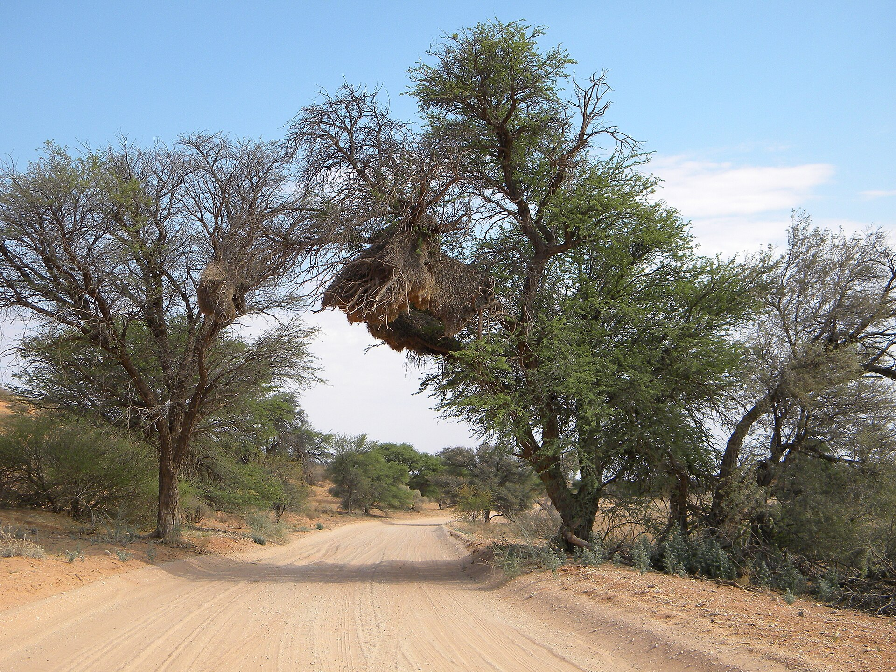
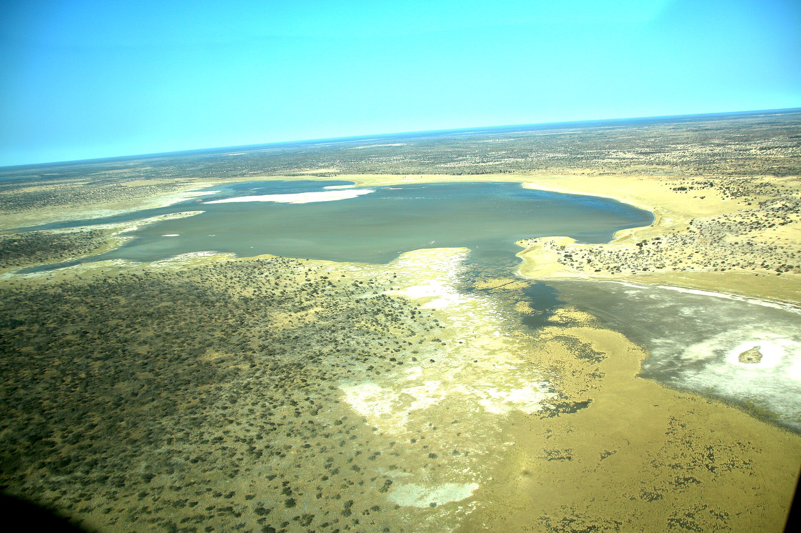
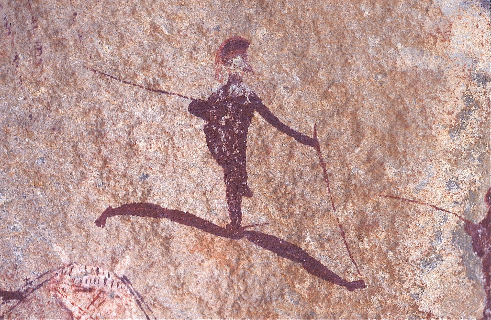
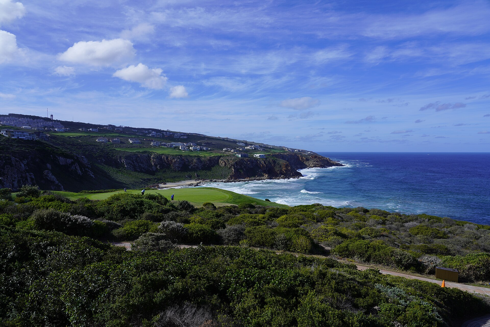
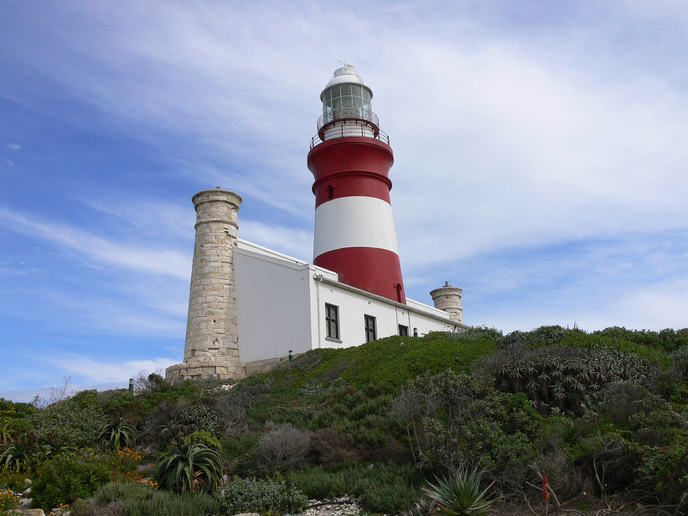
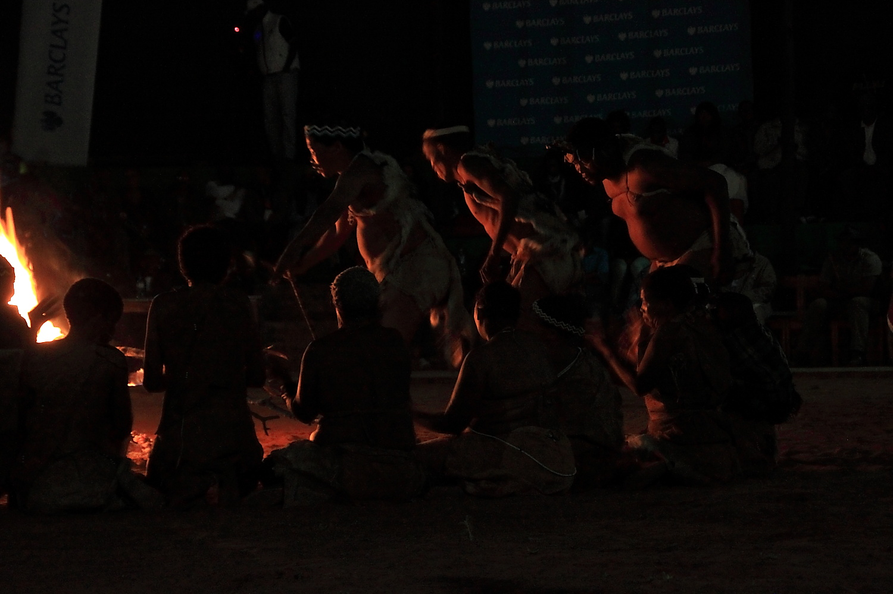
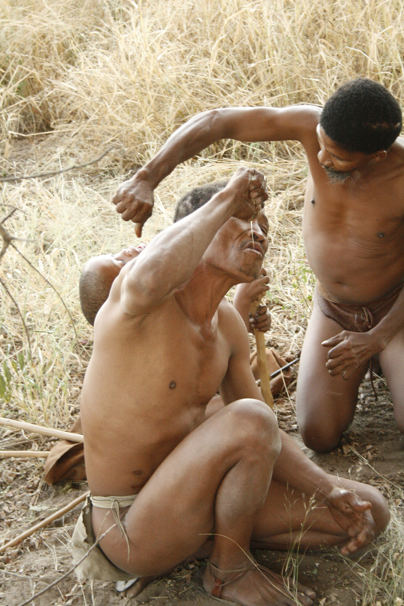
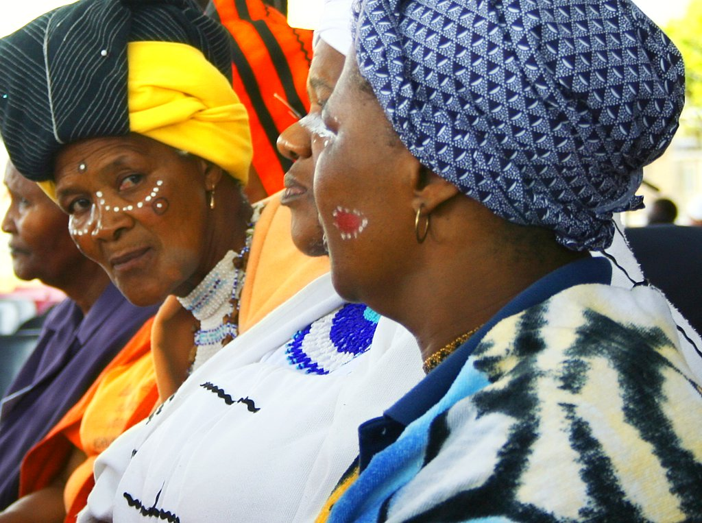

# A Man They All Read Wrong — real places & people

<!-- hand-authored -->

> The Jakobus Swart File · A photo wiki for travellers and curious readers.
> Jakobus is fiction; the Kalahari, the Border War country, and the people who read him wrong are drawn from real ground.
> **[Read the book](../../books/history-before-time/books/the-jakobus-file/build/BOOK.md)** · [All place wikis](README.md)

## Places of awe — the soldier's country

### Kgalagadi — red dunes at the edge of the Kalahari.

*See Wikimedia Commons file page for author and licence.*

### Nyae Nyae — San country, oldest storytelling on Earth.

*See Wikimedia Commons file page for author and licence.*

### Southern San rock art — the eland panel.

*See Wikimedia Commons file page for author and licence.*

## Places of awe — the coast everyone misremembers

### Pinnacle Point, Mossel Bay — where modern humans first cooked shellfish.

*See Wikimedia Commons file page for author and licence.*

### Cape Agulhas — where two oceans meet.

*See Wikimedia Commons file page for author and licence.*

## Peoples, in their own dress

### San healing dance — the oldest way there is of telling.

*See Wikimedia Commons file page for author and licence.*

### Naro Bushmen — Kalahari water from the bi bulb.

*See Wikimedia Commons file page for author and licence.*

### Xhosa dress — one living tongue made visible.

*mike barwood, CC BY-SA 2.0, via Wikimedia Commons*

---

*All photographs are freely licensed (public domain / CC) via [Wikimedia Commons](https://commons.wikimedia.org/).
See each caption for author and licence.*
