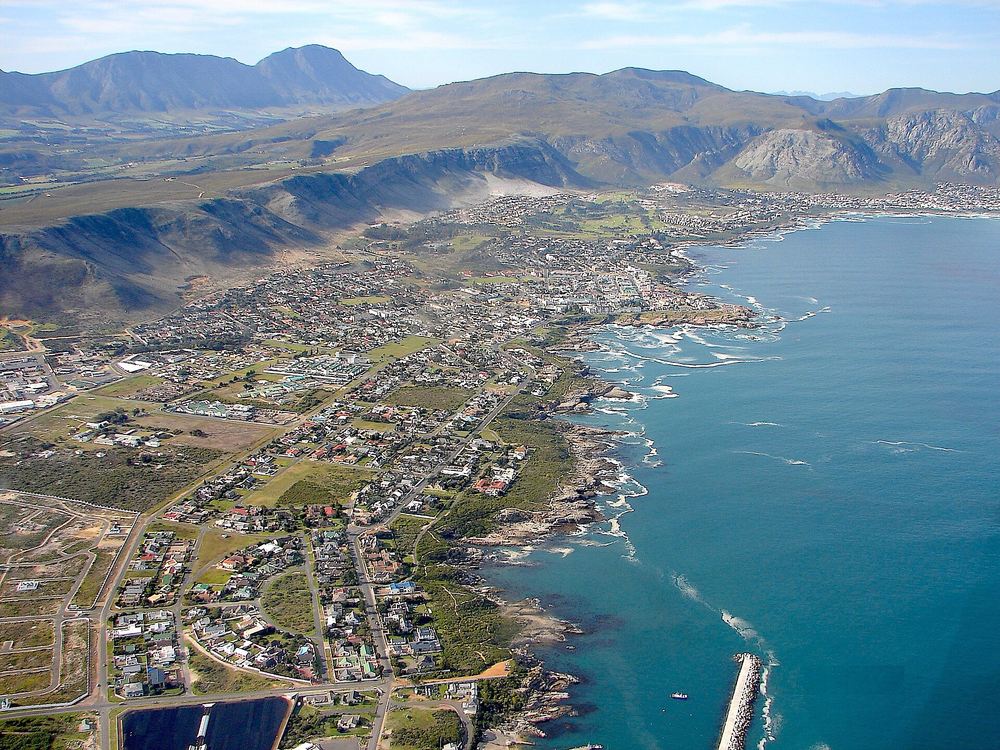
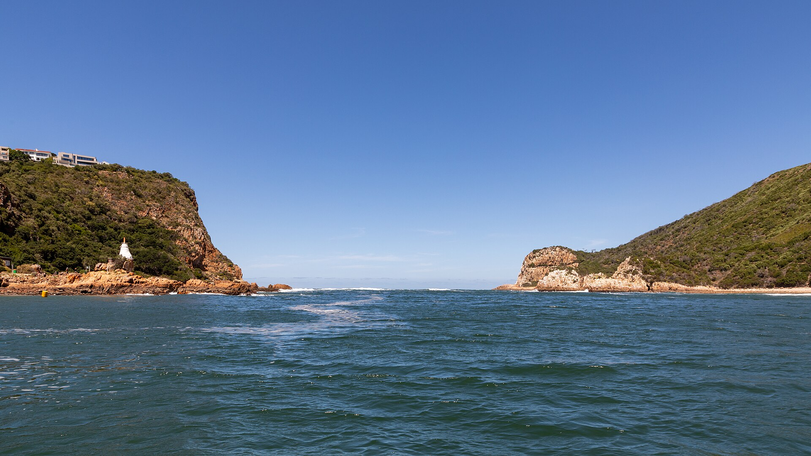
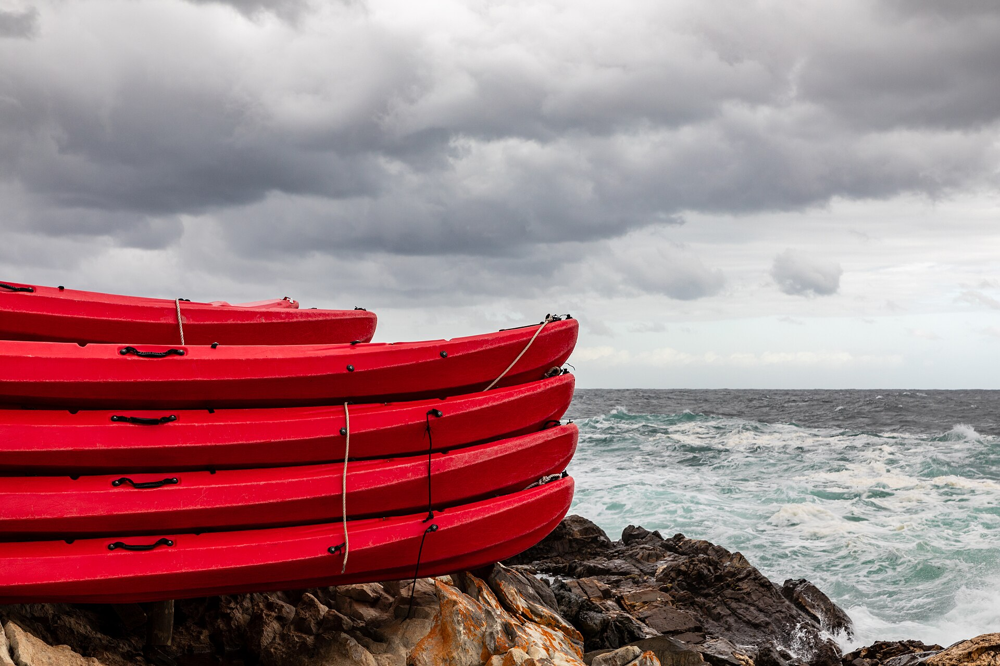
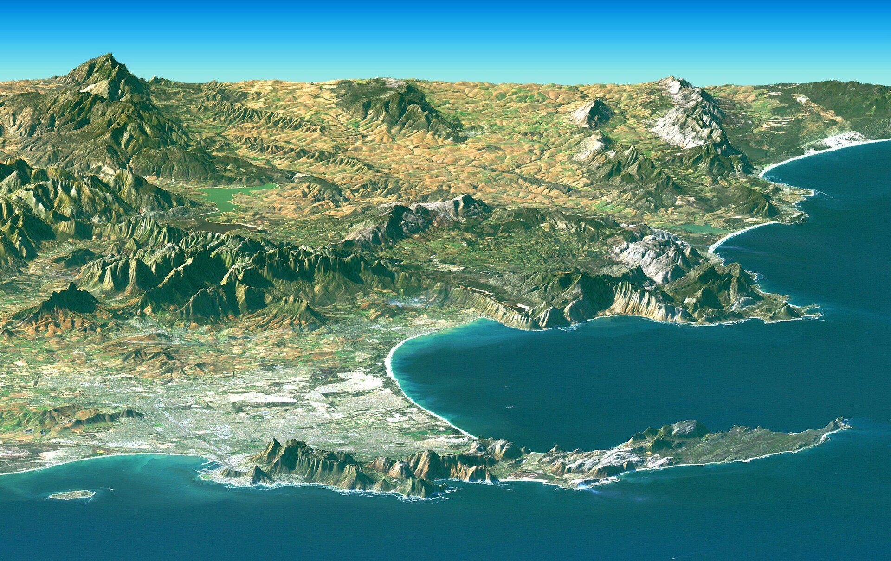
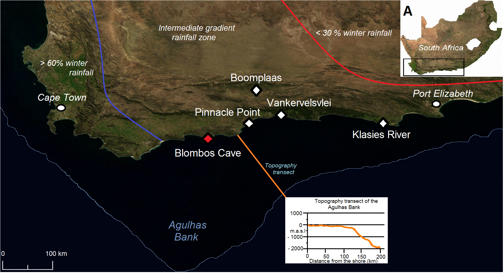
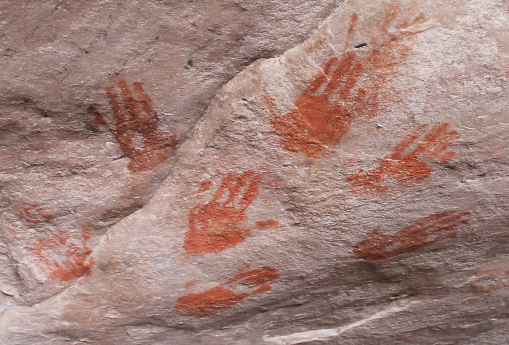

# The Loneliest People in the World — real places & people

<!-- hand-authored -->

> A standalone novella · A photo wiki for travellers and curious readers.
> The story is interior; the Southern Cape it moves through is real — wind, cliff, and the light that makes people hard to read.
> **[Read the book](../../books/the-loneliest/build/BOOK.md)** · [All place wikis](README.md)

## Places of awe — the Southern Cape

### Pinnacle Point — cliffs above the Indian Ocean.

*See Wikimedia Commons file page for author and licence.*

### Hermanus, Walker Bay — whale coast, winter wind.

*See Wikimedia Commons file page for author and licence.*

### Knysna Heads — river mouth, two cliffs, one passage.

*See Wikimedia Commons file page for author and licence.*

### Tsitsikamma coast — forest meeting rock and sea.

*See Wikimedia Commons file page for author and licence.*

### Cape Peninsula — the city at the end of Africa.

*See Wikimedia Commons file page for author and licence.*

## Things of wonder (made by hand)

### Blombos Cave — ochre and symbol, seventy thousand years deep.

*See Wikimedia Commons file page for author and licence.*

### Diepkloof rock shelter — hand prints older than empire.

*See Wikimedia Commons file page for author and licence.*

---

*All photographs are freely licensed (public domain / CC) via [Wikimedia Commons](https://commons.wikimedia.org/).
See each caption for author and licence.*
