# The Way That Was Invented — real places & people

> The Unheard · Japan · A photo wiki for travellers and curious readers.
> The novel is fiction; these grounds are real — go stand in them.
> **[Read the book](../../books/the-unheard/books/japan-ainu/build/BOOK.md)** · [All place wikis](README.md)

## Places of awe

### Hokkaidō — the Ainu homeland, renamed from Ezo within living memory of the land.

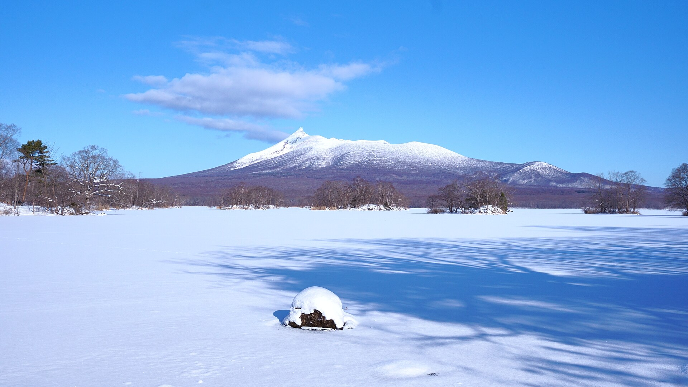

*掬茶, CC BY-SA 4.0, via Wikimedia Commons*

### Lake Akan — one of the surviving Ainu kotan (community) homes.

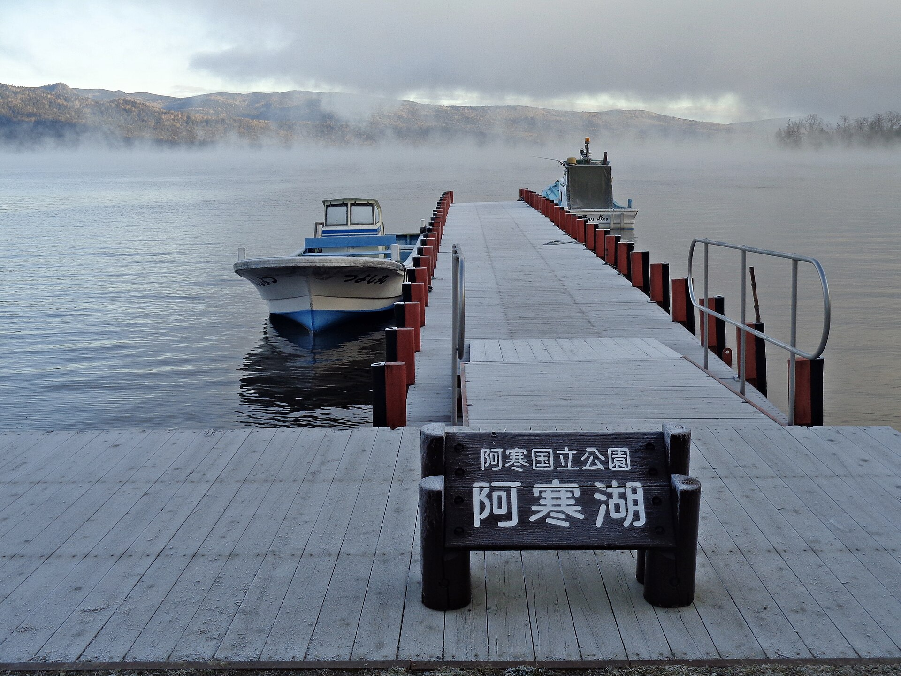

*ブルーノ・プラス, CC BY 4.0, via Wikimedia Commons*

### Upopoy, Shiraoi — Japan's first national Ainu institution (open the living-people question, not the glass case).

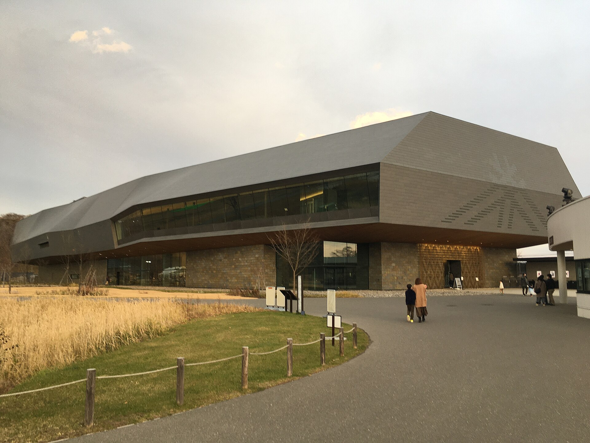

*Higa4, CC0, via Wikimedia Commons*

### The Ishi-no-Hōden 'floating rock', Takasago — hand-cut from the bedrock, its makers unknown.

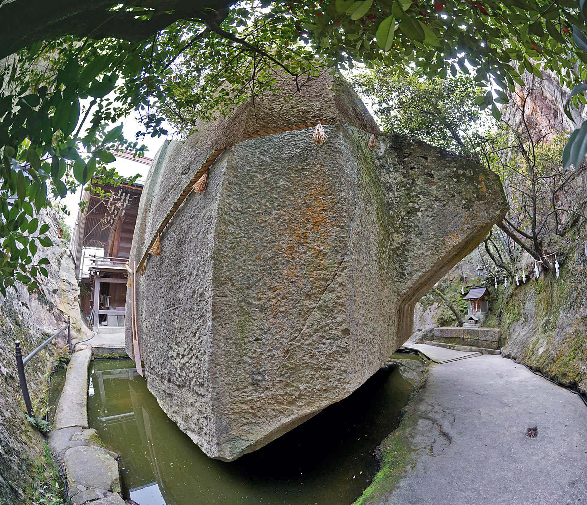

*z tanuki, CC BY 3.0, via Wikimedia Commons*

### Himeji and Hōryū-ji — the celebrated wonders the unheard hands actually built.

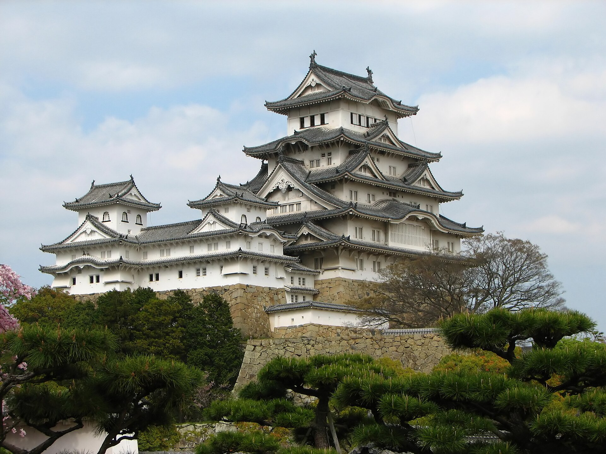

*Bernard Gagnon, CC BY-SA 3.0, via Wikimedia Commons*

## Things of wonder (made by hand)

### An attus elm-bast robe with moreu swirl appliqué — woven and cut by Ainu women.

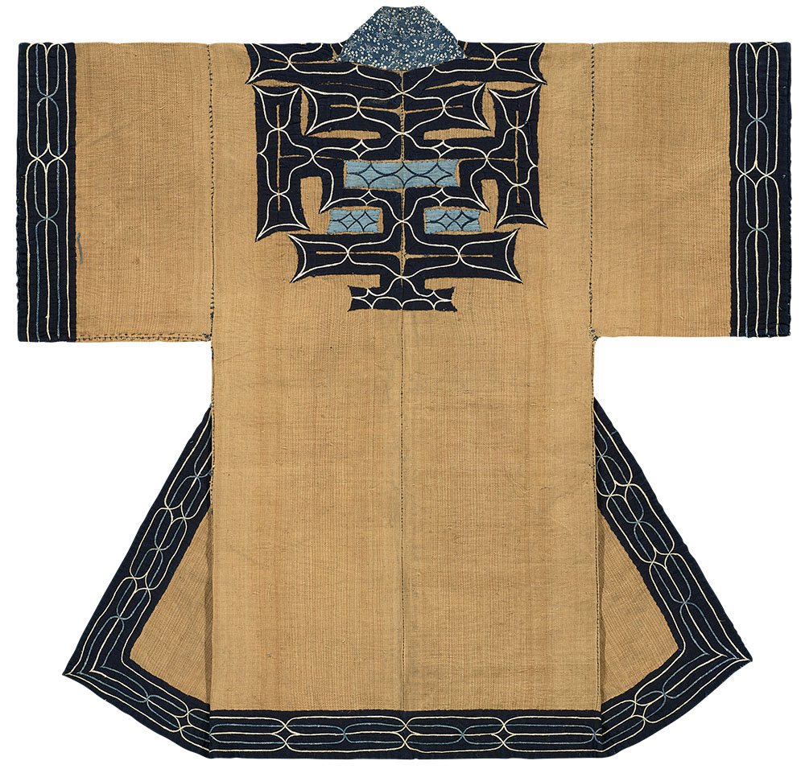

*Unknown Ainu artisan. Published in Hali magazine, Public domain, via Wikimedia Commons*

### The tonkori (five-string zither) and mukkuri (mouth-harp) — Ainu voice and string.

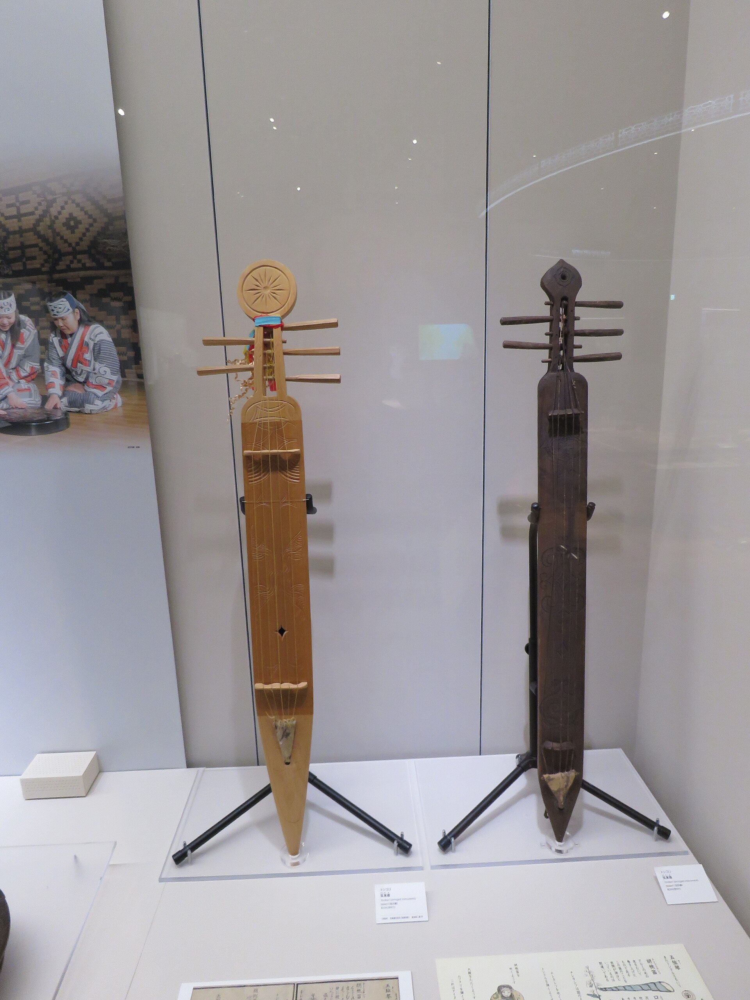

*Calistemon, CC BY-SA 4.0, via Wikimedia Commons*

### Tamahagane and the hamon — clean sortable carbon, real metallurgy, never katana-mysticism.

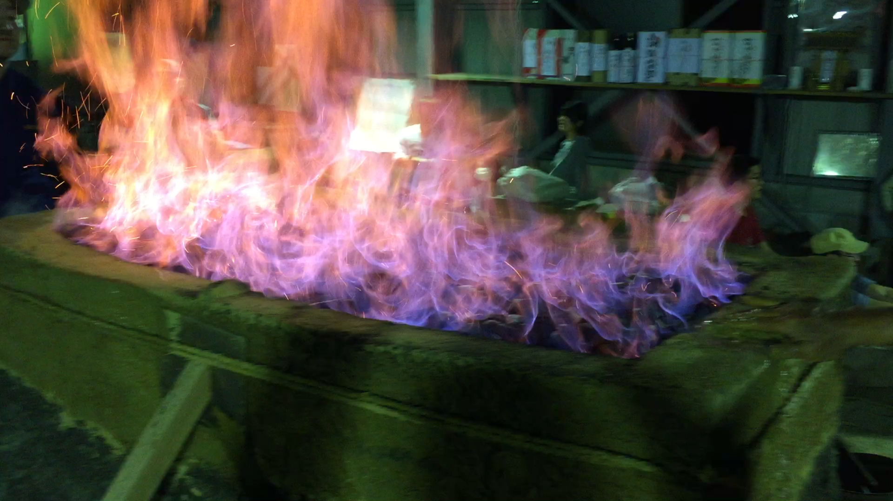

*Toby Manzanares, CC BY-SA 4.0, via Wikimedia Commons*

### The taiko — there is no drum without the leather the outcast hands once tanned.

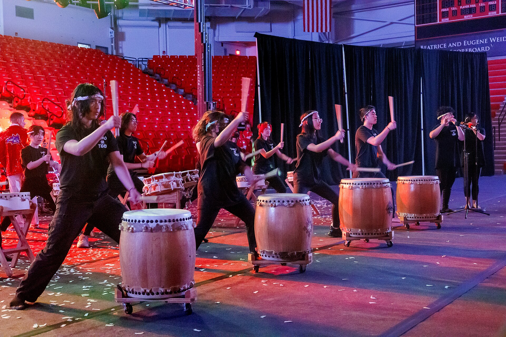

*Kenneth C. Zirkel, CC BY-SA 4.0, via Wikimedia Commons*

## Peoples, in their own dress

### Ainu people in their own dress — a living culture, modern and self-determining, not a relic.

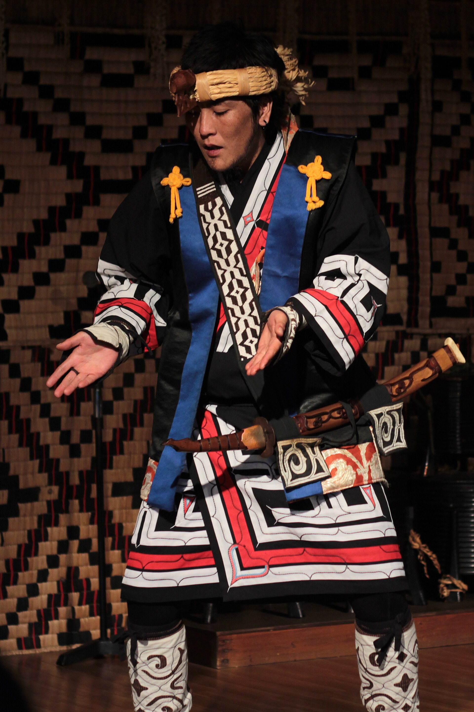

*Japanexperterna.se, CC BY-SA 3.0, via Wikimedia Commons*

### An Ainu elder — one of the keepers of a critically endangered language.

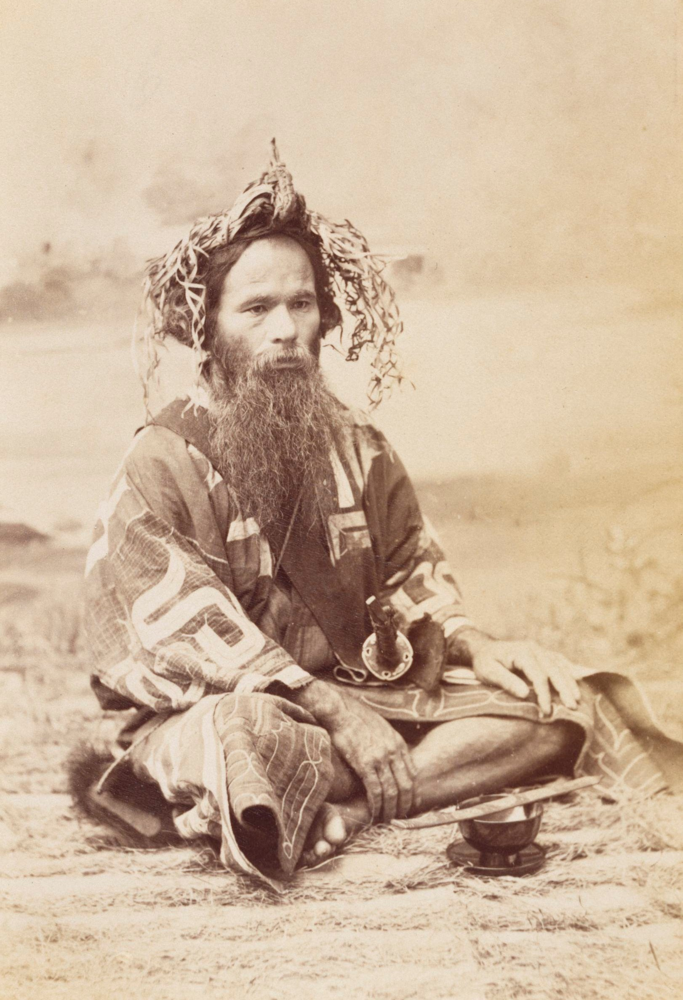

*Tamoto Kenzō, Public domain, via Wikimedia Commons*

### A yamabushi mountain ascetic — a near-extinguished living path, handed on, not graved.

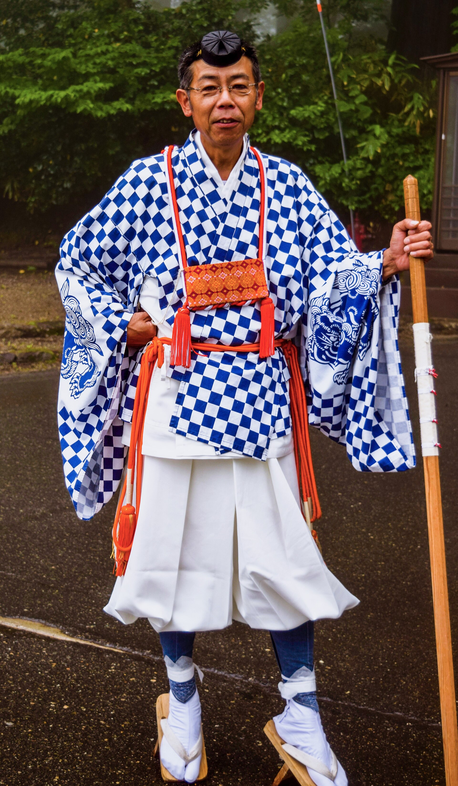

*Noah0812, CC BY-SA 4.0, via Wikimedia Commons*

---

*All photographs are freely licensed (public domain / CC) via [Wikimedia Commons](https://commons.wikimedia.org/).
See each caption for author and licence.*
