# The Felt and the Sky — real places & people

> The Unheard · Mongolia · A photo wiki for travellers and curious readers.
> The novel is fiction; these grounds are real — go stand in them.
> **[Read the book](../../books/the-unheard/books/mongolia-steppe/build/BOOK.md)** · [All place wikis](README.md)

## Places of awe

### The open steppe — land that reads as empty and is the most precisely known ground they walk.

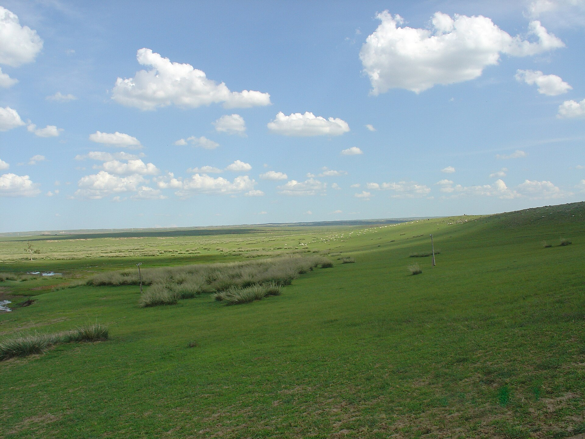

*Shizhao, CC BY-SA 3.0, via Wikimedia Commons*

### The Orkhon Valley — a thousand years of nomadic pastoral civilisation, UNESCO-listed.

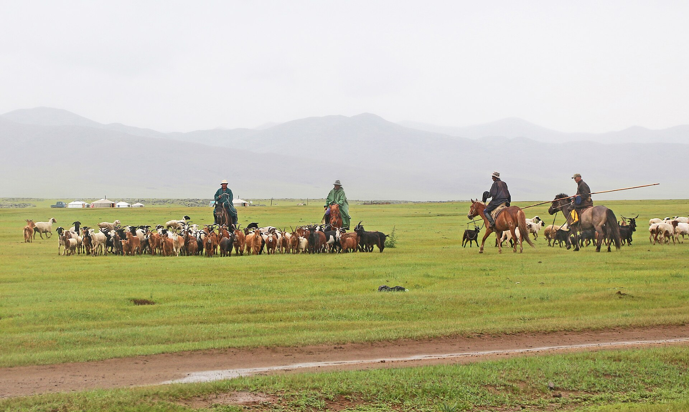

*Bernard Gagnon, CC0, via Wikimedia Commons*

### The Gobi — from +45°C to −40°C, the country the herders' judgement crosses.

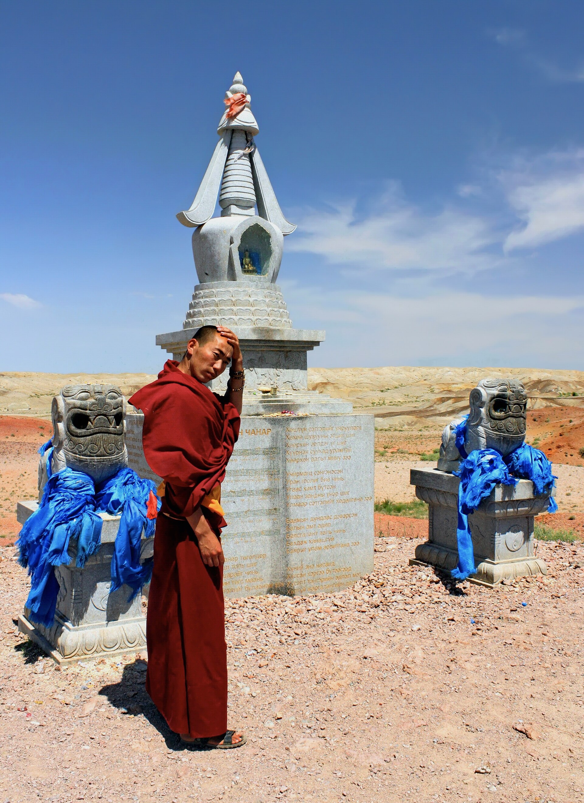

*Marcin Konsek, CC BY-SA 4.0, via Wikimedia Commons*

### Lake Khövsgöl — the northern water of the steppe.

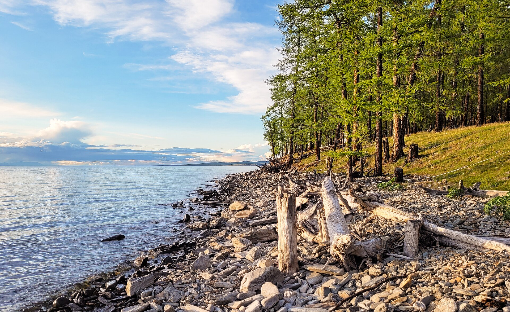

*Bernard Gagnon, CC0, via Wikimedia Commons*

### Erdene Zuu at Kharkhorin — the old capital ground, where stone meets felt.

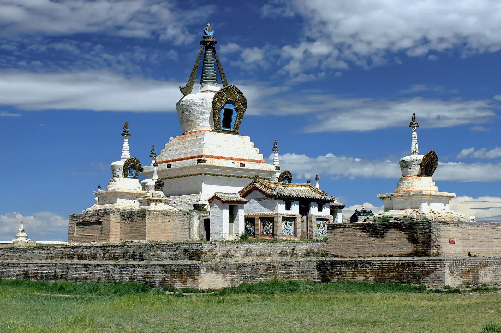

*Marcin Konsek, CC BY-SA 4.0, via Wikimedia Commons*

## Things of wonder (made by hand)

### The ger — felt from the herders' own sheep; the sheep are the house, raised in three hours.

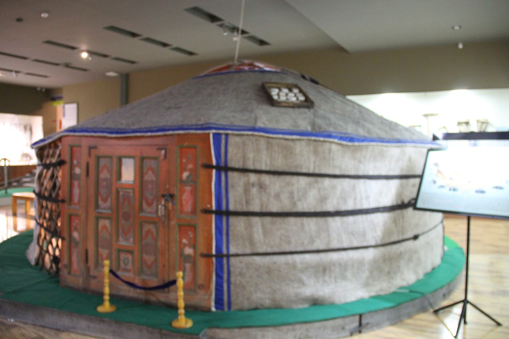

*Gary Todd, CC0, via Wikimedia Commons*

### The morin khuur (horse-head fiddle) — the steppe's two-string voice at the fire.

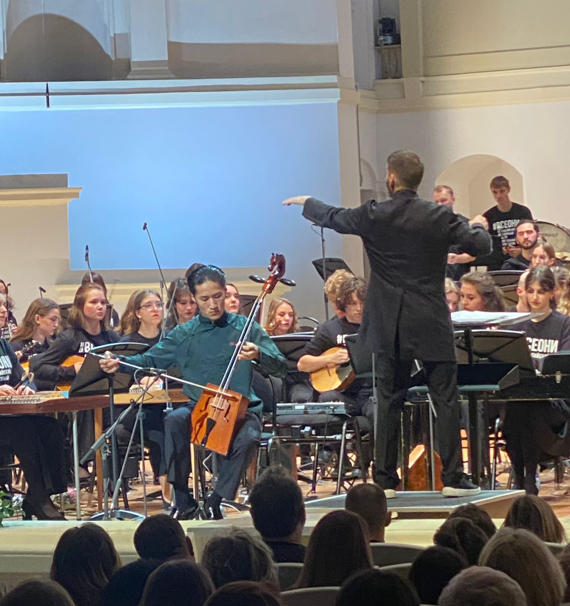

*ClipperDB, CC0, via Wikimedia Commons*

### Deer stones — Bronze Age standing stones carved across the steppe.

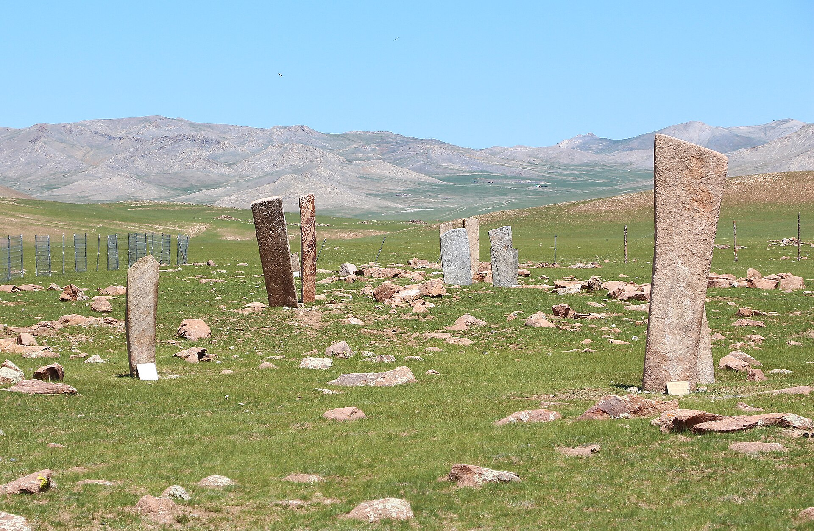

*Bernard Gagnon, CC0, via Wikimedia Commons*

### An ovoo cairn — circled three times clockwise; the book shows the threshold and looks away.

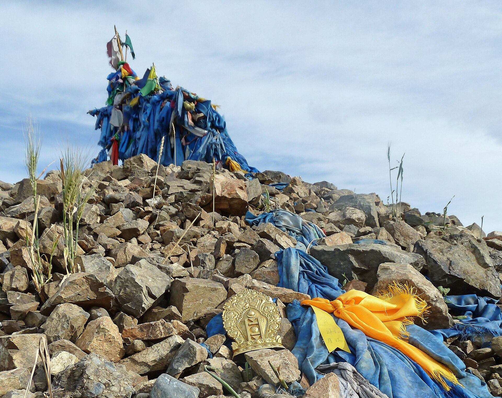

*Pierre André Leclercq, CC BY-SA 4.0, via Wikimedia Commons*

## Peoples, in their own dress

### A herder in the deel — the expert fighting to hand the life on, not a vanishing relic.

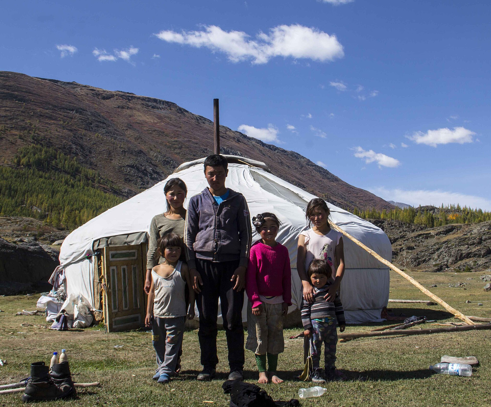

*Gabideen, CC BY-SA 4.0, via Wikimedia Commons*

### Bökh wrestlers at Naadam — title earned by craft, the Eagle Dance before the bout.

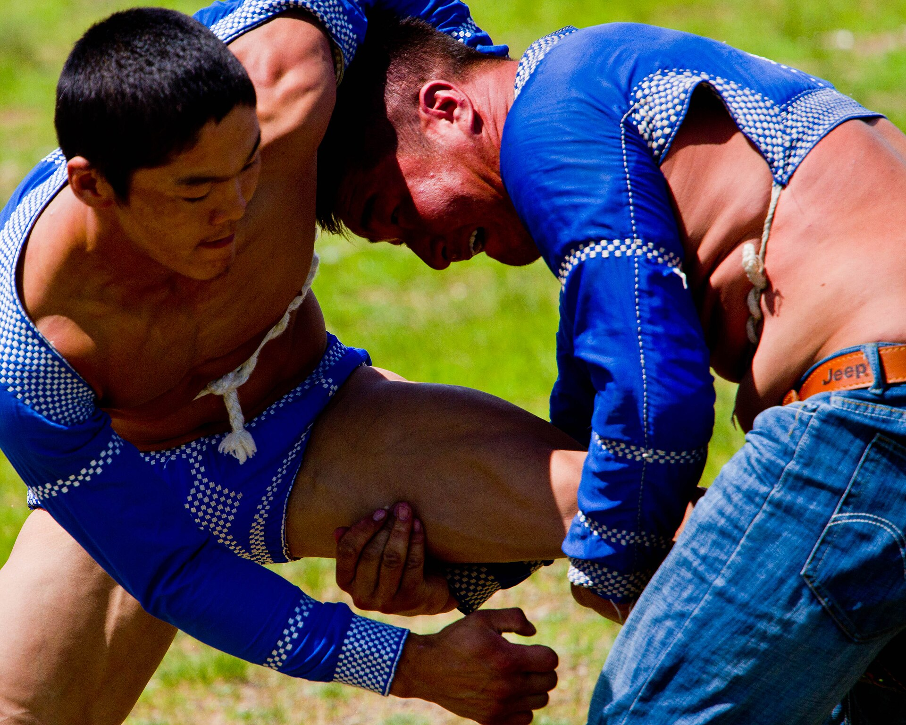

*Paulo Fassina, CC BY-SA 2.0, via Wikimedia Commons*

### A horseman on the steppe — horses the cultural backbone of the five snouts.

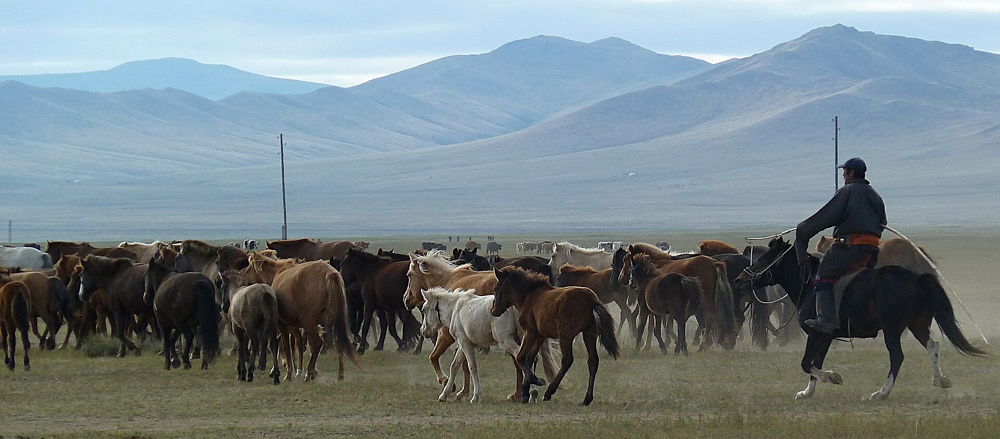

*Pierre André Leclercq, CC BY 4.0, via Wikimedia Commons*

---

*All photographs are freely licensed (public domain / CC) via [Wikimedia Commons](https://commons.wikimedia.org/).
See each caption for author and licence.*
